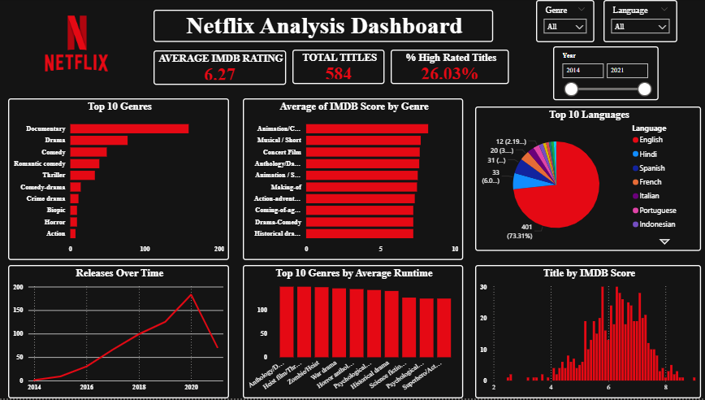

# Netflix Originals Analysis Dashboard 🎬📊

This project analyzes a **public Netflix Originals dataset** to understand content quality, genre performance, language distribution, runtime patterns, and release trends over time using **Power BI**.

## Key Highlights
- Analyzed **584 Netflix Original titles**
- Built an interactive **Power BI dashboard** with KPIs and filters
- Identified that only **~26% of titles are rated above 7 on IMDB**
- Compared **genre performance by volume vs quality**
- Analyzed **language dominance and global content presence**
- Studied **release trends** to understand Netflix’s content growth strategy

## Dashboard Features
- **KPIs:** Total Titles, Average IMDB Rating, % of High-Rated Titles  
- **Top 10 Genres** by number of titles  
- **Top 10 Genres by Average IMDB Rating**  
- **Top 10 Languages** used in Netflix Originals  
- **Netflix Originals Released Over Time**  
- **IMDB Rating Distribution** across all titles  

## Tools Used
- Power BI  
- Power Query  
- Data Analysis  
- Data Visualization  
- Dashboard Design  

## Preview

## Dataset
Public Netflix Originals dataset used for learning and analysis purposes only.
